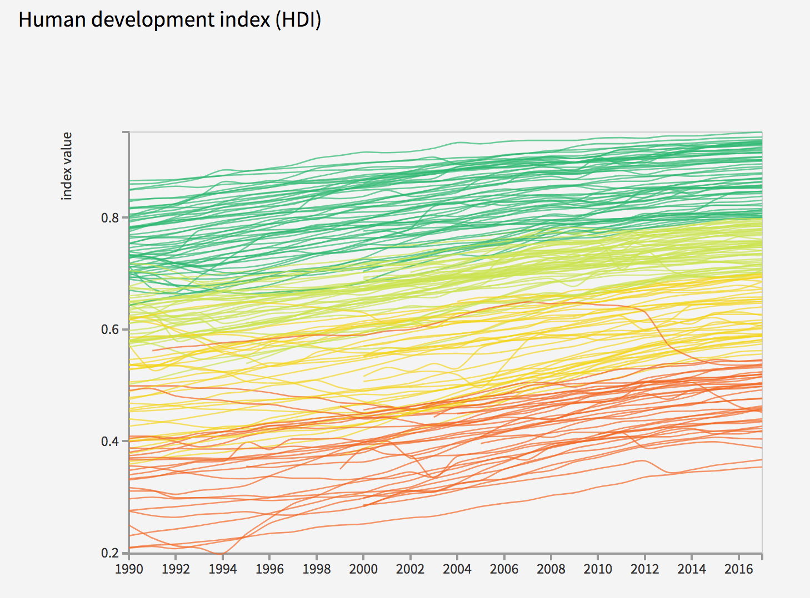

---
title: 'Stat 579 - Homework #7'
author: "Your Name"
date: "10/17/2019"
output: html_document
---

```{r setup, include=FALSE}
knitr::opts_chunk$set(echo = TRUE)
```

## Human Development Index

The United Nations Development Programme publishes an annual report on human development across the globe. An interactive tool to visualize some of the data is available at  http://hdr.undp.org/en/data 


1. Download the RMarkdown file with these homework instructions to use as a template for your work.
Make sure to replace "Your Name" in the YAML with your name.
2. Download the data for 2018 from the left side tab  stating [Download 2018 Human Development Data Bank](http://hdr.undp.org/sites/default/files/2018_all_indicators.xlsx). This will lead you to an Excel document. Open it and comment on the structure you find in the `Data' sheet. Comment on the overall structure in the context of "long" versus "wide" data.
3. There is an R package available online (on CRAN) that allows to read Excel files. Find the package, (install it if necessary), load it  and read the `Data' sheet "2018_all_indicators.xlsx" into R (make use of the available parameters). Compare the result in R with what is visible in Excel. Keep track of and comment on all steps in the process. 
For the write-up assume, that the Excel file is in the same folder as the homework Rmd file. Also assume, that both the TA and I have  updated versions of all packages you use, i.e. only load packages but do not install any in the code.
4. Bring the data into a long form. What setting do you use for missing values? How many indicators are in the data? Use `ggplot2` to show a barchart.
5. Two of the indicators are called `Human Development Index (HDI), male` and `Human Development Index (HDI), female`. Comment on this from a tidy data perspective.
6. Use `tidyr` and `dplyr` functionality to get the data set into a format to be able to recreate the plot below (from the United Nations website) in ggplot. Use a classification of HDI of very high for [0.8,1], high for [0.7, .8), medium for [.55, .7) and low below .55), color lines by the last available year. 1pt of extra for using a better color scheme than is shown below. 



Due date: please refer to the website and Canvas for the due date. 

For the submission: submit your solution in an R Markdown file and (just for insurance) submit the corresponding html/word file with it. 
